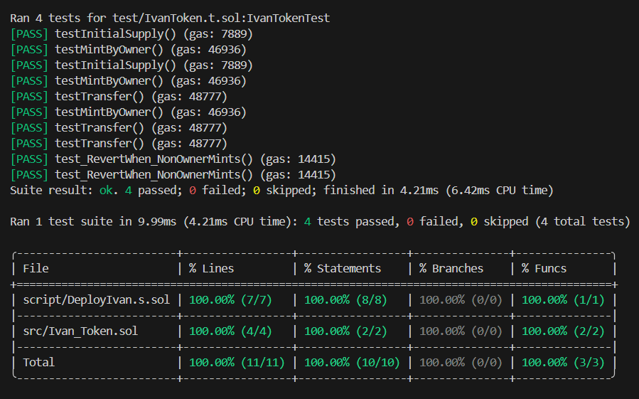

# 🚀 Ivan Token (IVN) - ERC20 Implementation

  

[](https://soliditylang.org/)

[](https://book.getfoundry.sh/)

[](https://opensource.org/licenses/MIT)

[](#-testing)

  

A professional, production-ready **ERC20** token implementation using the **Foundry** development framework and **OpenZeppelin** standards. This project serves as a showcase of smart contract best practices, including comprehensive testing, gas optimization, and automated deployment scripts.

---

## 🏗 Project Architecture


The project is structured following the Foundry standard layout for maximum efficiency and readability:

  

-  **`src/`**: Core smart contract logic.

-  **`test/`**: Unit tests written in Solidity for robust verification.

-  **`script/`**: Deployment and interaction scripts.

-  **`lib/`**: External dependencies (OpenZeppelin).

  

---
## 🛠 Tech Stack & Tools
- **Solidity:** ^0.8.20
-  **Framework:** [Foundry](https://book.getfoundry.sh/) (Forge & Cast)
- **Library:** [OpenZeppelin Contracts](https://openzeppelin.com/contracts/)
- **Infrastructure:** QuickNode RPC
  
---

## ✨ Features

  

-  **Standard Compliance:** Fully compatible with the ERC20 standard.

-  **Ownable & Secure:** Implements OpenZeppelin's `Ownable` for administrative functions (minting).

-  **Advanced Testing:** Utilizes modern Foundry cheatcodes like `vm.prank` and `vm.expectRevert`.

-  **Gas Optimized:** Compiled with the `via-ir` pipeline and `paris` EVM version for compatibility and efficiency.

  

---

  

## 🚀 Live Deployment (Amoy Testnet)

  

The contract is successfully deployed and live on the **Polygon Amoy Testnet**.

  

-  **Contract Address:** [`0x0Fc2C3f40f27d27953669a98035156227384Bc6C`](https://amoy.polygonscan.com/address/0x4fef70bb1dbe11B0F1135C8C65f019D02d418073)

-  **Network:** Polygon Amoy (Chain ID: 80002)

-  **Symbol:** IVN

-  **Initial Supply:** 1,000,000 IVN

  

---

  

## 🧪 Testing

  

This project maintains **100% code coverage**. We use strictly Solidity-based testing to ensure contract reliability.
### Key Tests:
1. **Initial Supply Check:** Verifies correct minting on deployment.
2. **Secure Transfers:** Ensures users can send/receive tokens.
3. **Access Control:** Validates that only the `Owner` can mint new tokens.

  

### Run Tests:

```bash
forge  test  -vv
```

---

  

### Coverage Report:

```bash
forge coverage
```



---

  

## Installation & Usage

### Prerequisites

- Foundry
```bash
curl -L https://foundry.paradigm.xyz | bash && foundryup
```

  

---

  

### Clone & Build

```bash
git  clone <your-repo-url>

cd  ERC20-Ivan-Token

forge  install

forge  build
```
---
## 📜 Deployment Script
The deployment is handled via Solidity scripts for idempotency and security.
```bash
script script/DeployIvan.s.sol --rpc-url $AMOY_RPC_URL --private-key $PRIVATE_KEY --broadcast --verify
```
---
## 📜 License
This project is licensed under the **MIT License**.

## Author
### Ali Nasirlou
Github : [`alinasirlou2020`](https://github.com/alinasirlou2020)
Linkedin : [`Ali Nasirlou`](https://www.linkedin.com/in/ali-nasirlou-14b6713b1/)
